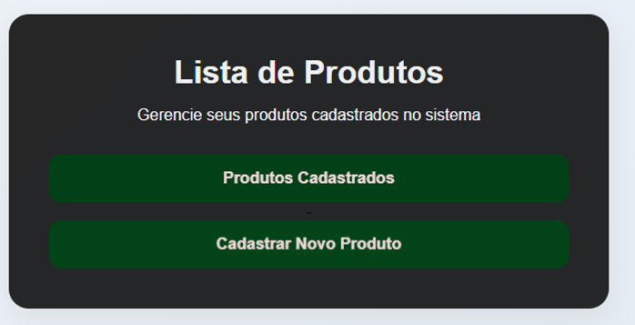
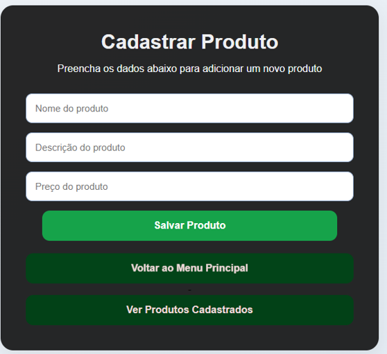

# Sistema de Cadastro de Produtos

Este projeto foi desenvolvido utilizando PHP, MySQL, HTML e CSS com o objetivo de criar um sistema simples de cadastro de produtos.

O sistema permite:

* Cadastrar produtos
* Listar produtos cadastrados
* Editar informações dos produtos
* Excluir produtos

---

## Tecnologias utilizadas

* PHP
* MySQL
* XAMPP
* phpMyAdmin
* HTML
* CSS

---

## Estrutura do projeto

```text
PRODUTOS/
│
├── index.php
├── cadastrar.php
├── cadastros.php
├── editar.php
├── excluir.php
├── conectar.php
├── style.css
├── produtos.sql
└── README.md
```

---

## Banco de dados

Banco utilizado:

```sql
sistema_produtos
```

Tabela principal:

```sql
produtos
```

Campos da tabela:

* id
* nome
* descricao
* preco

---

## Como executar

1. Instalar o XAMPP
2. Iniciar Apache e MySQL
3. Importar o arquivo `produtos.sql` no phpMyAdmin
4. Colocar a pasta do projeto dentro da pasta `htdocs`
5. Acessar no navegador:

```text
http://localhost/produtos/
```

---

## Telas do sistema

### Página inicial
<h4>
<<h4>

### Cadastro de produto

<h4>
<<h4>

### Lista de produtos

<h4>
<<h4>

---

## Observação

Este projeto foi desenvolvido como atividade acadêmica com foco no aprendizado de banco de dados e desenvolvimento web utilizando PHP com MySQL.

---

## Autor

Andre Luiz
Analise e Desenvolvimento de sistemas - Uniube 2026. 
RA 1184031-1
